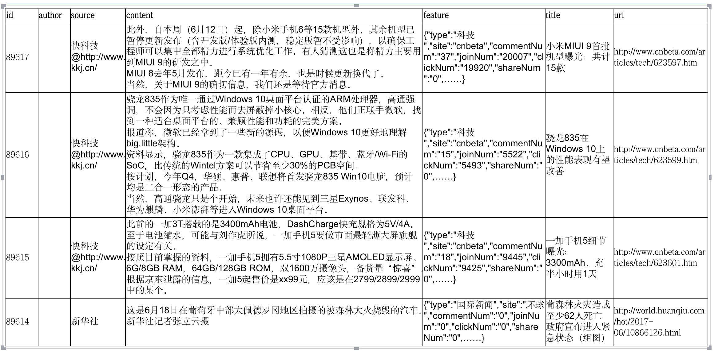

# Python-文本抄袭自动检测分析

    新闻单位工作人员（这里假设source=新华社），为了防止其他媒体抄袭其的文章，做一个抄袭自动检测分析的工具：
    
    1）定义可能抄袭的文章来源
    
    2）与原文对比定位抄袭的地方
    
### 环境

Python 3.7

jieba 

### 数据

原始数据：sqlResult.csv，共计89611篇

从数据库导出的文章，字段包括：id, author, source, content, feature, title, url

常用中文停用词：chinese_stopwords.txt

### 思路

    1、预测文章风格是否和自己一致 => 分类算法
    
    2、根据模型预测的结果来对全量文本进行比对，如果数量很大， 可以先聚类降维，比如将全部文档自动聚成k=25类
    
    3、文本特征提取 => 计算TF-IDF
    
    4、TopN相似 => TF-IDF相似度矩阵中TopN文档
    
    5、编辑距离editdistance => 计算句子或文章之间的编辑距离

###Code: 

Github：https://github.com/wangyang0922/BI/TextSimilarityDetection

